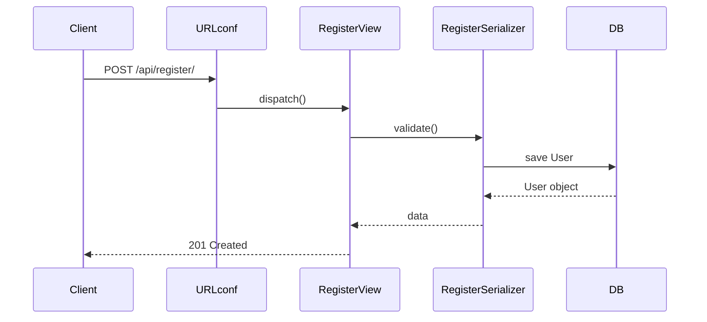

###### 코드리뷰의 정의:
	코드리뷰란, 한 개발자가 작성한 코드를 다른 개발자가 읽고 검토하여 품질
	을 높이는 협업 과정입니다.  
	즉, 코드를 단순히 “틀렸나?”만 보는 게 아니라, 품질·가독성·안전성·
	유지보수성까지 함께 점검하는 활동이에요.

---
###### 코드리뷰를 하는 이유:
1. 버그 조기 발견
    - QA나 배포 이후가 아니라, 코드 합치기 전에 문제를 잡아냅니다.
    - 작은 실수(오타, 조건 누락)부터 큰 오류(보안 취약점, 잘못된 비즈니스 로직)까지.
        
2. 일관성 유지
    - 프로젝트 전반에서 코드 스타일, 설계 방식이 제각각이면 유지보수가 어려움.
    - 리뷰를 통해 “우리 팀의 코드 표준”을 맞춰나감.
        
3. 지식 공유
    - 한 사람이 작성한 코드를 여러 명이 읽음 → 팀 전체가 해당 기능을 이해하게 됨.
    - “버스팩터” (한 사람이 빠지면 프로젝트가 멈춘다) 위험을 줄임.
        
4. 코드 품질 향상
    - 더 읽기 쉬운 변수명, 더 단순한 함수, 더 안전한 쿼리로 개선할 기회.
    - "지금도 되긴 하지만, 더 좋은 방법?"을 찾을 수 있음.
        
5. 학습 & 성장
    - 초보자는 시니어에게 배우고, 시니어도 다른 관점에서 피드백을 받음.
    - 리뷰 자체가 교육 자료이자 팀 학습 과정.
---
###### 코드 리뷰의 핵심 원칙:
1. 내가 작성한 코드만 먼저 본다 → 부모 클래스, 프레임워크 내부 코드는 나중에.
2. 작게 쪼개서 본다 → 파일 단위 → 클래스 단위 → 함수 단위.
3. 흐름도를 단계적으로 만든다 → “URL → View → Serializer → Model → 응답” 이 단순 선형 흐름부터.
4. 시각화는 꼭 필요한 범위만 → 모든 메서드 뽑지 말고, 내가 직접 만든 엔드포인트만 다이어그램화.
---
###### 코드 품질 판단 5가지 기준

`1.` 기능 정확성
    - 코드가 요구사항대로 동작하는가? (입력 → 처리 → 출력 확인)
    - 테스트를 돌려도 실패가 없는가?
        
`2.` 가독성
    - 변수·함수·클래스 이름이 의미를 잘 드러내는가? (`a, b` 대신 `user_id, restaurant_id`)
    - 들여쓰기, 줄바꿈, 주석이 읽기 편한가?
        
`3.` 구조와 의존성
    - 레이어 규칙이 지켜지는가? (예: 라우터 → 서비스 → 모델 단방향)
    - 불필요한 순환 import, 직접 DB 접근이 없는가?
        
`4.` 중복/복잡도
    - 비슷한 코드가 여러 곳에 반복되지 않았는가?
    - 한 함수가 너무 많은 일을 하지 않는가? (SRP: 단일 책임 원칙)
        
`5.` 안정성과 보안
    - 입력값 검증, 에러 처리, 예외 처리 로직이 있는가?
    - 민감정보(비밀번호, 토큰)가 코드에 하드코딩되지 않았는가?

---
### Django 코드리뷰 시각화

코드에서 자동으로 그림 뽑기 (변경해도 다시 뽑으면 끝)
```bash
brew install graphviz        # macOS
sudo apt-get install graphviz # Ubuntu (WSL 포함)

# Ubuntu/WSL:
sudo apt-get update
sudo apt-get install graphviz graphviz-dev

# macOS (Homebrew):
brew install graphviz
```

`django-extensions` 설치
```bash
pip install django-extensions
```

구조/의존/호출/복잡도/성능/보안 진단
```bash
pip install pylint graphviz pyan3 pydeps radon pytest pytest-django coverage bandit

# Django 성능/SQL 확인(선택): 둘 중 하나
pip install django-debug-toolbar

# 또는
pip install django-silk
```

`settings.py` → `INSTALLED_APPS`에
```python
INSTALLED_APPS = [
"django_extensions",
]

MIDDLEWARE = [
"debug_toolbar.middleware.DebugToolbarMiddleware",
]
```

전체 시각화(부모까지 보고싶을때)
```bash
pyreverse -AS -o svg -p payments ./payments
pyreverse -AS -o png -p payments ./payments
```
내 앱 안에 정의된 클래스들과 그 상속 관계를 보여줍니다.

작게보기
```bash
pyreverse -o svg -p myviews payments/views.py
```

ERD구조 이미지화
```bash
# 전체 ERD
python manage.py graph_models --all-applications -o png --output erd_all.png

# 모델ERD만 추출
python manage.py graph_models payments -o png --output erd_payments.png

python manage.py graph_models payments -o svg --output erd_payments.svg
```
개발 도중 `models.py`를 수정한 뒤 위 명령어를 다시 실행하면, 변경된 ERD가 새로 생성되므로 모델 구조 변화를 한눈에 파악할 수 있습니다.

![[Pasted image 20250902085936.png]]

파일단위로 쪼개서 시각화
```bash
pyreverse -o svg -p myviews payments/views.py
```
그러면 DRF 내부 부모 클래스는 생략, **내 클래스만 상자**로 나옵니다.

구조 다이어그램 + URL 매핑을 합치기:프로젝트 전체 URLconf(라우팅 테이블)
```bash
python manage.py show_urls --format=table | grep api
```
이걸 클래스 다이어그램 옆에 붙여주면 “이 URL이 이 박스로 간다”를 알 수 있습니다.
결과:
![[Pasted image 20250902081927.png]]
`show_urls`는 그 테이블을 읽어서:
1. URL 패턴 (`/api/register/`)
2. 연결된 View (`payments.views.RegisterView`)
3. URL name (`api-register`)

`README.md` 같은 문서에 그대로 작성하면 GitHub, GitLab, Notion 등은 자동으로 Mermaid 다이어그램으로 렌더링
```markdown
# 회원가입 API 흐름도

`README.md`에 저 코드를 넣고 푸시하면 자동으로 시퀀스 다이어그램이 그려집니다.

---
### Django 코드 리뷰 체크리스트

`1.` URL → View 연결
- `urls.py`에 경로와 이름이 있고, 올바른 View/ViewSet에 연결돼 있나?
- HTTP 메서드(GET/POST/PUT/DELETE)가 맞게 설정됐나?
    
`2.` 입력/출력 검증
- Serializer/Form이 요청 검증을 하고 있는가?
- 필수값, 타입, 길이, unique 조건이 체크되고 있는가?
    
`3.` View는 얇게, 로직은 서비스로
- View 안에서 DB 쿼리를 직접 하지 않고, 서비스/리포지토리로 위임했나?
- View는 “요청 → 검증 → 서비스 호출 → 응답” 흐름만 담당하는가?
    
`4.` 인증/권한
- 로그인/권한 제한이 필요한 API에 적용돼 있나? (`IsAuthenticated`, `@login_required`)
- 사용자가 자기 것만 수정/조회할 수 있게 로직에 반영됐나?
    
`5.` 예외 & 상태코드
- 잘못된 입력 → 400, 권한 없음 → 403/401, 생성 성공 → 201 등 상태코드가 정확한가?
- DB 중복/외부 API 실패가 적절히 처리돼 에러 메시지가 사용자 친화적인가?
    
`6.` 모델/ERD 일치
- 모델 필드와 ERD가 일치하나? (유니크/인덱스/외래키 on_delete 정책)
- 마이그레이션 누락이 없는가?
    
`7.` ORM/쿼리 성능
- 리스트 조회에서 `select_related` / `prefetch_related` 적용됐나?
- 페이지네이션이 설정돼 있나?
    
`8.` 보안/설정 위생
- 비밀키·토큰이 코드에 하드코딩돼 있지 않고, 환경변수로 관리되는가?
- `ALLOWED_HOSTS`, `CSRF`, `SECURE_*` 같은 배포 환경 보안 설정이 체크됐나?
---
🔎 빠른 코드리뷰(최소 루트)
1. URL–View–Serializer–Model 순으로 훑기
2. 권한/검증/상태코드/중복 네 가지를 중점 확인
3. ERD와 UNIQUE/인덱스 확인
4. View는 짧게, 로직은 서비스로 이동
5. 테스트는 최소한 성공/실패/권한 3가지 케이스 넣기
---
### Fast API 코드리뷰 시각화

FastAPI + ORM + Graphviz 도구
```bash
pip install fastapi uvicorn sqlalchemy alembic psycopg2-binary

# pip 업그레이드 (권장)
pip install pygraphviz pydotplus pylint pyan3 pydeps radon eralchemy2
```
`sqlalchemy` + `alembic` → 모델 정의와 마이그레이션용
`psycopg2-binary` → PostgreSQL 예시 (SQLite면 필요 없음)

ERD / 다이어그램 도구
```bash
# 공통적으로 필요한 Graphviz
sudo apt-get update && sudo apt-get install graphviz graphviz-dev -y  # Ubuntu/WSL
brew install graphviz   # macOS

# 파이썬 바인딩
pip install pygraphviz pydotplus
```

현재 프로젝트 구조 경로기준
```
fdapi/
 ├─ fastdining_api/src      ← 여기가 실제 FastAPI 앱
 │   │             ├─ core/
 │   │             ├─ routers/
 │   │             ├─ schemas/
 │   │             ├─ models/
 │   │             └─ ...
 │   └─ main.py
 └─ .venv/
```
따라서 `pyreverse` 실행 대상 디렉터리는 `fastdining_api/` 입니다.

코드 안에 정의된 클래스와 상속 관계를 UML 다이어그램으로 뽑는 도구 실행 방법
```bash
pyreverse -o svg -p fastdining_api src/models src/routers src/schemas src/core
```
- `src/models src/routers src/schemas src/core` 경로
- `-p fastdining_api` : 다이어그램 제목(Project name)

결과: 두개의 svg파일이 생깁니다.
`classes_fastdining_api.svg` : 클래스 상속/관계 UML 다이어그램
- 클래스 상속/관계 UML 다이어그램
- `class` 단위로 상속, composition(포함), association(연관) 관계를 보여줌
- 예시:
    - `User(BaseModel)` → BaseModel로부터 상속
    - `Order` → `User`를 ForeignKey로 참조 (association 관계)
- 즉, “내 코드에 어떤 클래스가 있고, 서로 어떻게 연결돼 있는지”를 시각화.

`packages_fastdining_api.svg` : 모듈/패키지 의존 다이어그램
- Python 파일(모듈)이나 폴더(패키지) 간의 `import` 관계를 보여줍니다.
- 예시:
    - `routers/orders.py` → `schemas/orders.py`를 import 했다면, 화살표가 그려짐
    - `models/` → `core/database.py`를 import 했다면 연결 표시
        
즉, “파일/폴더 간의 import 구조”를 시각화해 줍니다.  
쉽게 말해 폴더 구조 기반 아키텍처 다이어그램입니다.

---
###### ERD (DB 모델 구조) 뽑기

터미널 위치를 프로젝트 루트로 맞추기:
```bash
cd ~/각자의 프로젝트 루트로 이동
# 예시 cd ~/fdapi/fastdining_api
```

패키지 인식 준비(한 번만) : 자신의 경로를 꼭 확인하세요.
```bash
# 패키지 인식 – 모델에서 뽑을 때만 필요
touch src/__init__.py src/models/__init__.py src/core/__init__.py src/schemas/__init__.py
export PYTHONPATH=$PWD
```

pyan3 라이브러리 버전을 안정 버전으로 교체
```bash
pip uninstall -y pyan3
pip install "pyan<0.11"
```

드라이버 설치(예: MySQL이면 `pymysql`):
```bash
# 필요한 패키지
pip install eralchemy2 python-dotenv
# DB 드라이버 (예: MySQL)
pip install pymysql
# (Postgres를 쓰면) pip install psycopg2-binary
```

아래 그대로 실행 (프로젝트 루트 `~/fdapi/fastdining_api`):
```bash
mkdir -p docs

python - <<'PY'
import os
from pathlib import Path
from dotenv import load_dotenv
from eralchemy2 import render_er

# .env 로드
if Path(".env").exists(): load_dotenv(".env")
elif Path(".env.sample").exists(): load_dotenv(".env.sample")

url = os.getenv("DATABASE_URL") or os.getenv("DATABASE_URL_READ") or "sqlite:///./test.db"
print("Using DB:", url)

# 바로 SVG/PNG로도 가능(중간 .er 생략 가능)
# render_er(url, "docs/erd_from_db.svg")

# 여기서는 .er도 저장
render_er(url, "docs/erd_from_db.er")
print("Wrote:", Path("docs/erd_from_db.er").resolve())
PY

# .er -> svg/png (eralchemy2가 변환)
python -m eralchemy2.main -i docs/erd_from_db.er -o docs/erd_from_db.svg
python -m eralchemy2.main -i docs/erd_from_db.er -o docs/erd_from_db.png

ls -lh docs/erd_from_db.*
```
전제: DB에 테이블이 실제로 존재해야 합니다(마이그레이션/초기화 완료 상태).

---
### 무엇을 보고, 어떻게 판단/조치할지 정리

###### 프로젝트 구조에서 모듈 의존 다이어그램 뽑기
깊이 1 (models 최상위 레벨만) -> 간략하게 
```bash
# src 하위의 최상위 레벨만 (깊이 1)
pydeps src --noshow -T svg -o docs/deps_top.svg \
  --max-module-depth=1 --rankdir=LR --rmprefix src.
```
내 코드(`src`)가 어떤 외부 라이브러리/모듈에 의존하는지”를 시각적으로 정리한 것
![[Pasted image 20250903071153.png]]
읽는 방법
- **원** = 모듈/패키지 (점으로 표시된 노드)
- **화살표** = “→” 방향으로 의존성이 있음 (= A가 B를 import 함)

---
 깊이 2 상세히 뽑기
```bash
pydeps src --noshow -T svg -o docs/deps_depth2.svg \
  --max-module-depth=2 --rankdir=LR --rmprefix src.
```

deps_depth2.svg（프로젝트 전체 흐름 요약）
![[Pasted image 20250903071929.png]]

아키텍처 흐름 확인
- 무엇을 봄: `routers → operators → models → core` 같은 흐름 방향이 잘 지켜지는지
- **판단**: 라우터가 모델을 직접 가져다 쓰거나, 모델이 라우터를 import 하는 역방향이 없는지 확인
- **조치**: 잘못된 참조 발견 시 → “서비스/오퍼레이터 계층을 거쳐 접근하도록 수정하세요” 코멘트
    
---
2. 순환 의존성(↔) 점검
- 무엇을 봄: 화살표가 양방향(↔)으로 이어진 노드가 있는지
- 판단: 순환 import 는 에러/복잡성 원인 → 좋지 않음
- 조치: 공통 부분을 `core`나 `dependencies`로 분리, 단방향 구조로 정리

쉽게 말해서 
- A 파일이 B 파일을 import 하고, 동시에 B 파일이 A 파일을 import 하는 상황이에요.  
    → “너 나 불러, 나도 너 부를게” 꼬리를 무는 구조.
    
- 왜 문제냐?
    - 실행 시점에 Python이 어떤 걸 먼저 불러와야 할지 몰라서 `ImportError` 같은 문제가 생김
    - 코드 구조가 꼬여서 수정하기 어려워짐
        
- 이미지에서 어떻게 찾나?
    - 화살표가 양쪽으로 오가는 ↔ 형태가 있으면 순환 의존성.
    - 예: `user_model ↔ restaurant_model` 식으로 서로 화살표가 연결된 경우
        
- 조치:
    - 두 파일 모두에서 공통으로 필요한 부분을 `core/` 같은 제3의 파일로 빼내기
    - import 방향을 한쪽으로만 유지

---
3. 과도한 결합도 점검
- 무엇을 봄: 화살표가 지나치게 많이 연결된 노드 (in/out-degree 높은 노드)
- 판단: God 모듈(모든 곳에서 의존) → 유지보수 어려움
- 조치: 기능별로 분리 (`core/utils.py` → `core/strings.py`, `core/validation.py` 등)

쉽게 말해서
- 어떤 파일(모듈)에서 화살표가 엄청 많이 뻗어 나가거나, 여러 파일이 한 곳을 몰려서 참조하고 있는 경우예요.
    - 예: 다들 `core/utils.py`만 가져다 쓰는 상황
        
- 왜 문제냐?
    - 그 파일이 조금만 바뀌어도 여러 군데가 줄줄이 깨짐
    - 유지보수/테스트가 힘들어짐
        
- 이미지에서 어떻게 찾나?
    - 특정 노드에 화살표가 **과하게 몰려 있으면** 의심
    - (ex. 그림에서 `core` 같은 곳이 보통 제일 많이 연결됨)
        
- 조치:
    - 기능별로 쪼개서 나누기 (`core/utils.py` → `core/strings.py`, `core/validation.py` 등)
    - 인터페이스나 서비스 계층 도입

---
파이썬 모듈 간 import 관계
ex:
```python
from sqlalchemy import BigInteger, Column, Float, String, Time, DateTime, ForeignKey, Table
from sqlalchemy.orm import relationship
from src.core.database import Base
from src.models import restaurant_tag_model
```

특정 패키지(예: `src/models`)만 뽑기
```bash
pydeps src/models --noshow -T svg -o docs/deps_models_internal.svg \
  --only src.models --rankdir=LR --rmprefix src.models.
```

deps_models_internal.svg（models 내부 관계만）
![[Pasted image 20250903072757.png]]

1) 모델끼리 서로 import 하는가?
- 무엇을 봄: `A_model ↔ B_model` 또는 `A_model → B_model` 같은 모델 간 화살표
    
- 판단:
    - 상호(↔)이면 **순환 의존** → 위험(ImportError/구조 꼬임)
    - 일방(→)도 **자주/여러 곳**이면 결합도 높음
        
- 조치:
    - 공통 상수/타입/헬퍼는 `models/_shared.py` 등으로 분리하고 모델끼리 참조를 끊기
    - 관계(외래키/relationship)는 import 없이 문자열 참조(`relationship("Tag")`)로 표현
        
---
2) “허브”처럼 과도하게 연결된 모델이 있는가?
- 무엇을 봄: 화살표가 한 모델로 몰리거나 많이 뻗는 노드(예: `restaurant_model`)
    
- 판단: God 모델 가능성 → 수정 영향이 커지고 테스트가 어려움
    
- 조치:
    - 역할별로 파일을 쪼개기(ex. `restaurant_model.py` → `restaurant_core.py`, `restaurant_link.py`)
    - 관계/조인 전용 로직은 중립 모듈(ex. `models/links.py`)로 이동
        
---
3) import로 표현된 관계가 정말 필요한가?
- 무엇을 봄: `from src.models import X_model` 같은 직접 모델 import
    
- 판단: 단지 외래키/관계 때문이라면 직접 import 불필요
    
- 조치:
    - `relationship("OtherModel")`, `ForeignKey("other_model.id")`처럼 문자열/테이블명으로 바꿔서 모델 간 import 제거
    - 스키마/DTO가 필요하면 `schemas/`로 분리하여 모델이 스키마에 의존하지 않게 함

---
특정 라우터 파일(import 관계 확인) 자신의 경로와 확인
```bash
pydeps src/routers/restaurants_router.py --noshow -T svg -o docs/deps_restaurants_router.svg \
  --max-module-depth=2 --rankdir=LR --rmprefix src.
```

deps_restaurants_router.svg（특정 라우터 단일 파일 중심）
![[Pasted image 20250903074112.png]]
1) 라우터의 경계가 지켜졌나?
- 무엇을 봄: 라우터 노드에서 뻗는 화살표가 어디로 가는지  
    (FastAPI, `schemas/`, `operators|services`, `dependencies` 정도여야 함)
    
- 판단: 라우터가 `models/`, `sqlalchemy.*`, DB 엔진/세션으로 직접 이어지면 경계 침범
    
- 조치: 라우터 → 서비스(오퍼레이터)로 우회
    - ❌ `from src.models import Restaurant`
    - ✅ `from src.operators.restaurant_operator import get_restaurant`
    - DB 접근은 서비스/리포지토리에서 처리, 라우터에는 I/O·검증·에러매핑만 남기기
        
---
2) 불필요한 의존이 과하지 않은가?
- 무엇을 봄: 라우터에서 너무 많은 외부/내부 모듈로 화살표가 뻗는지(팬아웃)  
    (예: auth, cache, ORM, utils, templates… 전부 다 직접 들고 있지 않은지)
    
- 판단: 팬아웃이 크면 결합도↑/테스트 난이도↑
    
- 조치: 의존을 의미 단위로 모으기
    - 인증/캐시는 `dependencies/`에서 `Depends(...)`로 주입
    - 공통 유틸은 서비스에서 사용하고 라우터는 호출만
    - 응답 스키마는 `schemas/`로 통일
        
---
3) 순환/역방향 의존이 있는가?
- 무엇을 봄: 라우터 ↔ 서비스/모델 양방향(↔) 화살표,  
    혹은 서비스/모델 → 라우터(역방향) 화살표
    
- 판단: 순환/역방향은 취약 & 유지보수 위험
    
- **조치**: 공통 코드는 `core/`로 분리하고 단방향(라우터 → 서비스 → 모델) 유지
---
###### 코드 리뷰를 통한 활용 포인트

- **온보딩**: 팀원이 합류했을 때, 그림 한 장으로 "API → 서비스 → DB" 구조를 설명 가능.
- **테스트 설계**: 흐름도를 기준으로 “어느 단계에서 단위 테스트/통합 테스트를 넣을지” 결정.
- **리팩터링**: 복잡한 순환 import, 서비스-DB 강결합 지점을 눈으로 확인 → 리팩토링 우선순위 설정.
- **문서화**: README, Wiki, 발표자료에 붙여서 아키텍처 설명에 활용.
- **디버깅**: 기능별 실행 경로를 따라가며 "여기까지는 통과, 여기서 에러"를 쉽게 추적.

---
###### 실제 활용 예시 (코드리뷰 + 기능분석)

- 기능정의 리스트 작성
- 좋아요 버튼 누리기 기능 선택
- 코드 흐름 확인
	- 시작점: API 엔드포인트 (예: `POST /likes`)
	- 중간: 어떤 함수나 클래스가 처리하는지 (예: `LikesService.create_like`)
	- 끝: DB 테이블에 어떤 데이터가 저장되는지 (예: `likes` 테이블 insert)

리뷰할 때 체크하는 핵심 포인트 (실제 현업)
- 요청/응답이 올바른가? (예: user_id, restaurant_id 잘 받는지)
- 권한/인증이 필요한가? (로그인 안 하면 막히는지)
- 중복 처리가 되는가? (같은 유저가 같은 가게를 여러 번 좋아요 누르면?)
- DB 제약조건이 맞는가? (UNIQUE, FK 등)
👉 이게 코드리뷰에서 가장 많이 지적되는 부분이에요.

---
기능정의/분석을 그림(이미지)로 바로 확인할 수 있게, 산출물 4개를 자동으로 뽑는 명령 세트

현재 프로젝트 구조 경로기준
```
fdapi/
 ├─ fastdining_api/src   
 │   │             ├─ core/
 │   │             ├─ routers/
 │   │             ├─ schemas/
 │   │             ├─ models/
 │   │             └─ app.py ← 여기에 app = FastAPI() 이코드가 있다.
 │   └─ main.py
 └─ .venv/
```

`1)` 엔드포인트(시작점) 리스트 → endpoints_like.md
“요청/응답이 올바른가?” 확인용으로, OpenAPI에서 like 관련 경로만 뽑아 문서화.
```bash
cd ~/fdapi/fastdining_api
export PYTHONPATH=$PWD
mkdir -p docs   # ← 없으면 만들어두기

python - <<'PY'
import re, json, pathlib
from importlib import import_module
from fastapi.routing import APIRoute

# FastAPI app 불러오기 (당신 프로젝트에 맞게)
app = import_module("src.app").app  
# 예: fastdining_api.src.app 자신의 경로를 확인한후 수정

# 2) OpenAPI 스펙에서 like 관련 경로만 수집
spec = app.openapi()
want = re.compile(r"like", re.I)

rows = []
for path, item in spec.get("paths", {}).items():
    if not want.search(path): 
        continue
    for method, op in item.items():
        if method.upper() not in {"GET","POST","PUT","PATCH","DELETE"}: 
            continue
        summ = op.get("summary") or ""
        rows.append(f"- `{method.upper():6}` {path}  —  {summ}")

out = pathlib.Path("docs/endpoints_like.md")
out.write_text("# LIKE endpoints\n\n" + "\n".join(sorted(rows)) + "\n", encoding="utf-8")
print("Wrote:", out.resolve())
PY
```
산출물: `docs/endpoints_like.md` (API 엔드포인트 시작점 목록)

`2)` 모듈 의존 흐름(라우터→서비스→모델) → deps_like.svg
“중간에 누가 처리하나?”를 한 눈에. `like` 관련 모듈만, 깊이 제한 2.
```bash
# 라우터에서 2단계만 펼치기, 좌→우 방향, 접두어 src. 제거
pydeps src --noshow -T svg -o docs/deps_like.svg \
  --only src.routers src.operators src.models \
  --max-bacon=2 --rankdir=LR --rmprefix src. \
  -x '.*tests.*' '.*alembic.*' '.*__pycache__.*'
```
너무 넓으면 `--only src.routers.likes_router` 처럼 라우터를 더 좁혀 쓰세요.
산출물: `docs/deps_like.svg`  
읽는 법: **A → B** 는 “A가 B를 import(의존)” → 계층이 의도대로인지 체크.

`3)` 실제 호출 흐름(함수 간 콜 플로우) → call_like.svg
“POST → 어떤 함수 → 어떤 저장 함수?”를 호출 그래프로. `like` 포함 파일만 대상으로.
```bash
# pyan 안정판(중요): pip install "pyan<0.11"
FILES=$(grep -RIl --include="*.py" -i "like" src || true)
[ -z "$FILES" ] && echo "like 관련 파일을 찾지 못했습니다" || \
pyan $FILES --dot --no-defines | dot -Tsvg -o docs/call_like.svg
```
**산출물**: `docs/call_like.svg`  
읽는 법: **라우터 핸들러 → 서비스 함수 → DB 저장 함수**로 이어지는 화살표를 추적.

`4)` 데이터 저장(끝점) 구조(ERD) → **erd_like.svg**
“어떤 테이블에 저장되나? 중복/제약은?”을 보는 **ERD**.  
① 전체 ERD를 만들고, ② 좋아요 관련 테이블만 부분 ERD로 추출.
```bash
# 4-1) 전체 ERD (.er 중간포맷 생성 후 svg/png로)
python - <<'PY'
import os, pathlib
from dotenv import load_dotenv
from eralchemy2 import render_er

if pathlib.Path(".env").exists(): load_dotenv(".env")
elif pathlib.Path(".env.sample").exists(): load_dotenv(".env.sample")

url = os.getenv("DATABASE_URL") or os.getenv("DATABASE_URL_READ") or "sqlite:///./test.db"
render_er(url, "docs/erd_full.er")
print("Wrote ER:", pathlib.Path("docs/erd_full.er").resolve())
PY

python -m eralchemy2.main -i docs/erd_full.er -o docs/erd_full.svg

# 4-2) 좋아요 관련만 부분 ERD로 (필요한 테이블/관계 키워드 수정)
LIKE_KEYS='fdc_users_likes_restaurants|auth_user|fdc_restaurants'
awk -v keys="$LIKE_KEYS" '
  BEGIN{FS=OFS="\n"}
  /^\[/ || /^[a-z_]+ .*--\*/ || /^[a-z_]+ 1--\*/ || /^\*/ || /^[a-z_]+ \?--\*/ { block = $0 }
  { if (block!="") {print block; block=""} }
  { print }
' docs/erd_full.er | grep -E "(^\[|--|\])" | grep -E "$LIKE_KEYS|^\[|--" > docs/erd_like.er

python -m eralchemy2.main -i docs/erd_like.er -o docs/erd_like.svg
```
**산출물**:
- `docs/erd_full.svg` (전체)
- `docs/erd_like.svg` (좋아요 관련만) ← **이걸 주로 봄**
    
읽는 법:
- `auth_user 1--* fdc_users_likes_restaurants` : 유저 1명이 여러 좋아요
- 유니크/인덱스는 모델 정의서도 함께 확인(필요시 ERD 외에 DDL/모델 코드 확인)

이렇게 4장만 보면 기능정의 분석이 끝납니다
1. endpoints_like.md → 시작점(API 계약)
2. deps_like.svg → 라우터→서비스→모델 의존 구조
3. call_like.svg → 실제 호출 흐름
4. erd_like.svg → 최종 저장 테이블과 관계
    

> 이 4장 + 체크리스트(요청/권한/중복/제약)를 맞대면서 보면,  
> “좋아요 기능”의 시작–중간–끝이 그림으로 정리됩니다.

---
### Fast API 코드리뷰 체크리스트

`1.` API 경로 & 메서드
- 엔드포인트가 명확히 정의됐나? (`/users`, `/likes`)
- HTTP 메서드가 맞게 사용됐나? (조회=GET, 저장=POST, 수정=PUT/PATCH, 삭제=DELETE)
    
`2.` 요청/응답 데이터
- 요청 데이터가 Pydantic 모델로 검증되는가? (`UserCreate`)
- 응답 데이터도 별도 모델로 정의됐나? (`UserResponse`)
- 응답에 비밀번호 같은 민감정보가 포함되지 않았나?
    
`3.` 코드 구조
- 라우터 함수는 짧고 단순한가? (“요청 → 서비스 호출 → 응답”)
- DB 접근은 service/repository에서만 처리되는가?
    
`4.` DB/모델 일치
- 모델 필드 이름·타입이 DB(ERD)와 맞는가?
- 외래키(FK), unique 제약조건이 필요한 곳에 있는가?
    
`5.` 예외 & 보안
- 잘못된 요청은 `HTTPException(400/404/409)`으로 처리되는가?
- 인증 필요한 API에 `Depends(get_current_user)` 같은 보호 장치가 있는가?
    
`6.` 문서화 & 테스트
- `response_model`이 설정돼 Swagger UI 문서가 올바른가?
- `tags`, `summary`가 있어 API 목적이 명확한가?
- 최소한의 테스트(`TestClient`)로 성공/실패/권한 케이스가 확인되나?
    
 `7.` 프로젝트 구조
- `routers/`, `schemas/`, `models/`, `services/`로 역할이 나뉘었나?
- `main.py`는 단순히 `include_router(...)`만 하고 있나?
---
🔎 먼저 체크할 3대 포인트
1. 라우터가 DB 직접 만지지 않는가? (→ 서비스 계층 확인)
2. 요청/응답이 Pydantic 모델로 검증되는가?
3. 인증/권한과 에러처리가 빠짐없이 있는가?

