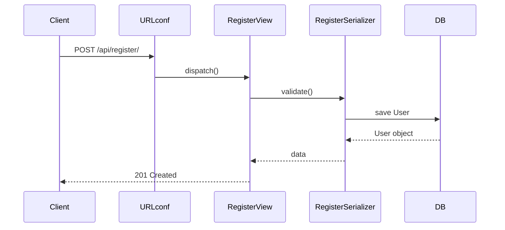

코드 리뷰의 핵심 원칙
1. 내가 작성한 코드만 먼저 본다 → 부모 클래스, 프레임워크 내부 코드는 나중에.
2. 작게 쪼개서 본다 → 파일 단위 → 클래스 단위 → 함수 단위.
3. 흐름도를 단계적으로 만든다 → “URL → View → Serializer → Model → 응답” 이 단순 선형 흐름부터.
4. 시각화는 꼭 필요한 범위만 → 모든 메서드 뽑지 말고, 내가 직접 만든 엔드포인트만 다이어그램화.


코드에서 자동으로 그림 뽑기 (변경해도 다시 뽑으면 끝)
```bash
brew install graphviz        # macOS
sudo apt-get install graphviz # Ubuntu (WSL 포함)

# Ubuntu/WSL:
sudo apt-get update
sudo apt-get install graphviz graphviz-dev

# macOS (Homebrew):
brew install graphviz
```

`django-extensions` 설치
```bash
pip install django-extensions
```

구조/의존/호출/복잡도/성능/보안 진단
```bash
pip install pylint graphviz pyan3 pydeps radon pytest pytest-django coverage bandit

# Django 성능/SQL 확인(선택): 둘 중 하나
pip install django-debug-toolbar

# 또는
pip install django-silk
```

`settings.py` → `INSTALLED_APPS`에
```python
INSTALLED_APPS = [
"django_extensions",
]

MIDDLEWARE = [
"debug_toolbar.middleware.DebugToolbarMiddleware",
]
```

전체 시각화(부모까지 보고싶을때)
```bash
pyreverse -AS -o svg -p payments ./payments
pyreverse -AS -o png -p payments ./payments
```
내 앱 안에 정의된 클래스들과 그 상속 관계를 보여줍니다.

작게보기
```bash
pyreverse -o svg -p myviews payments/views.py
```

ERD구조 이미지화
```bash
# 전체 ERD
python manage.py graph_models --all-applications -o png --output erd_all.png

# 모델ERD만 추출
python manage.py graph_models payments -o png --output erd_payments.png

python manage.py graph_models payments -o svg --output erd_payments.svg
```
개발 도중 `models.py`를 수정한 뒤 위 명령어를 다시 실행하면, 변경된 ERD가 새로 생성되므로 모델 구조 변화를 한눈에 파악할 수 있습니다.


파일단위로 쪼개서 시각화
```bash
pyreverse -o svg -p myviews payments/views.py
```
그러면 DRF 내부 부모 클래스는 생략, **내 클래스만 상자**로 나옵니다.

구조 다이어그램 + URL 매핑을 합치기:프로젝트 전체 URLconf(라우팅 테이블)
```bash
python manage.py show_urls --format=table | grep api
```
이걸 클래스 다이어그램 옆에 붙여주면 “이 URL이 이 박스로 간다”를 알 수 있습니다.
결과:
![[Pasted image 20250902081927.png]]
`show_urls`는 그 테이블을 읽어서:
1. URL 패턴 (`/api/register/`)
2. 연결된 View (`payments.views.RegisterView`)
3. URL name (`api-register`)


`README.md` 같은 문서에 그대로 작성하면 GitHub, GitLab, Notion 등은 자동으로 Mermaid 다이어그램으로 렌더링
```markdown
# 회원가입 API 흐름도

`README.md`에 저 코드를 넣고 푸시하면 자동으로 시퀀스 다이어그램이 그려집니다.

---
코드 리뷰 체크리스트
0) 시작 전 2분 준비
-  **URL 매핑 확인**: `python manage.py show_urls --format=table`로 내가 볼 엔드포인트 잡기
-  **테스트 전부 실행**: `pytest -q` 또는 `python manage.py test`
-  **바뀐 파일 범위 파악**: PR에서 변경 파일/라인 먼저 스캔
    
---
1) 기능/정확성 (Blocker)
-  요구사항대로 동작하는가? (예: 등록, 검증, 상태 전이)
-  **입력 검증**: 필수값 누락·형식 오류·범위(음수/최대치) 처리 있는가
-  **예외 처리**: DB 예외(중복, 무결성), 외부 API 실패 처리
-  **HTTP 상태코드**:
    - 생성 `201`, 잘못된 입력 `400/422`, 중복 `409`, 권한 `401/403`, 없음 `404`, 외부 의존 실패 `502/424` 등 의미에 맞게 쓰는가
-  **일관된 응답 스키마**: `{ ok, data | error, code }` 형태로 클라가 파싱 쉬운가
-  멱등성/중복 호출에 안전한가 (특히 웹훅/재시도)
    
---
2) 가독성/유지보수 (Must)
-  **한 함수 20~40줄 내**로 책임이 뚜렷한가 (길면 분리)
-  **명명**: `co`, `res` 대신 `order`, `response`처럼 역할이 드러나는가
-  **레이어 분리**: View는 입출력, **검증은 Form/Serializer**, **비즈니스는 Service**, **DB는 Model/Repository**로 나뉘었는가
-  **하드코딩 금지**: URL/비밀키/상수는 `reverse()`, `settings` 활용
-  중복 코드 제거(공통 로직 util/service화)
    
---
3) 보안 (Blocker)
-  **인증/권한**: 민감 API에 `IsAuthenticated`/권한 체크 적용
-  **입력 데이터 신뢰 금지**: 서버에서 재검증, 정수/범위 검사 필수
-  **비밀키/토큰**: 코드에 하드코딩 금지, `settings`/환경변수 사용
-  **서명/웹훅 검증**: HMAC 등 **정확한 비교(시간상수 비교)**로 처리
-  **오류 메시지**: 내부 정보 노출 금지(스택/키/쿼리 등)
    
---
4) 데이터 모델/ERD (Should)
-  **모델 상태값**: `TextChoices` 등으로 제한(‘임의 문자열’ 금지)
-  **인덱스/유니크**: 검색키·중복 방지 키에 `db_index=True`/`unique=True`
-  **삭제 정책**: `on_delete`가 기대와 맞는가(CASCADE/PROTECT/SET_NULL)
-  **ERD 변경 반영**: `graph_models`로 최신 ERD 생성해 차이 확인
    
---
5) 외부 API/네트워크 (Must)
-  **타임아웃/재시도**: `requests` 호출에 `timeout`/재시도 전략 있는가
-  **에러 매핑**: 외부 4xx/5xx → 우리 API 상태코드/메시지로 의미 있게 변환
-  **로그**: 실패·경계 상황에 식별 가능한 로그(요약, PII 제외)
    
---
6) 성능/쿼리 (Should)
-  **N+1 방지**: `select_related`/`prefetch_related`가 필요한 곳에 있는가
-  **필요 이상 로드 금지**: 전체 컬럼/전체 리스트 로드 지양
-  프로파일 도구(선택): `django-debug-toolbar`/`silk`로 SQL 개수·시간 확인
    
---
7) 에러 처리/로그/관측성 (Should)
-  **예측 가능한 에러 포맷**: 클라가 분기 가능한 `code` 포함
-  **로그 레벨**: INFO/WARNING/ERROR 구분, 민감정보 마스킹 
-  **트레이싱 키**: 주문ID/요청ID 등 상관관계 식별자 로그 포함
    
---
8) 테스트/커버리지 (Must)
-  핵심 플로우 **성공/실패/경계값** 각각 테스트
-  외부 API 실패/타임아웃/서명 불일치 등 **부정 경로 테스트**
-  상태코드·응답스키마 단언
-  커버리지 확인: `coverage run -m pytest && coverage report -m` (핵심 >80%)
    
---
9) 라우팅/템플릿/리다이렉트 (Should)
-  `reverse()`/`` 사용(하드코딩 금지)
-  URL 네임 일관성(문서·테스트·템플릿 동일)
-  `show_urls` 결과와 코드가 어긋나지 않는가
    
---
10) 문서/다이어그램 (Nice)
-  README에 **Mermaid 시퀀스** 1개(핵심 엔드포인트) 추가
-  ERD/클래스 다이어그램 최신화(SVG 권장)
-  변경 요약/마이그레이션 영향 기록
    
---
