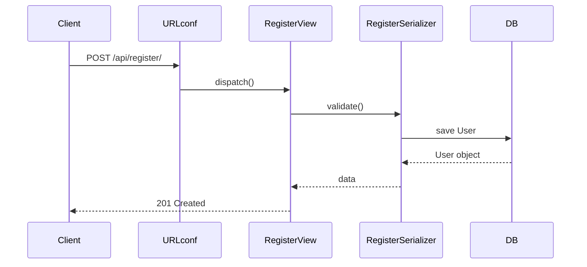

코드리뷰의 정의:
	코드리뷰란, 한 개발자가 작성한 코드를 다른 개발자가 읽고 검토하여 품질을 높이는 협업 과정입니다.  
	즉, 코드를 단순히 “틀렸나?”만 보는 게 아니라, 품질·가독성·안전성·유지보수성까지 함께 점검하는 활동이에요.

---
코드리뷰를 하는 이유:
1. 버그 조기 발견
    - QA나 배포 이후가 아니라, 코드 합치기 전에 문제를 잡아냅니다.
    - 작은 실수(오타, 조건 누락)부터 큰 오류(보안 취약점, 잘못된 비즈니스 로직)까지.
        
2. 일관성 유지
    - 프로젝트 전반에서 코드 스타일, 설계 방식이 제각각이면 유지보수가 어려움.
    - 리뷰를 통해 “우리 팀의 코드 표준”을 맞춰나감.
        
3. 지식 공유
    - 한 사람이 작성한 코드를 여러 명이 읽음 → 팀 전체가 해당 기능을 이해하게 됨.
    - “버스팩터” (한 사람이 빠지면 프로젝트가 멈춘다) 위험을 줄임.
        
4. 코드 품질 향상
    - 더 읽기 쉬운 변수명, 더 단순한 함수, 더 안전한 쿼리로 개선할 기회.
    - "지금도 되긴 하지만, 더 좋은 방법?"을 찾을 수 있음.
        
5. 학습 & 성장
    - 초보자는 시니어에게 배우고, 시니어도 다른 관점에서 피드백을 받음.
    - 리뷰 자체가 교육 자료이자 팀 학습 과정.
---
코드 리뷰의 핵심 원칙:
1. 내가 작성한 코드만 먼저 본다 → 부모 클래스, 프레임워크 내부 코드는 나중에.
2. 작게 쪼개서 본다 → 파일 단위 → 클래스 단위 → 함수 단위.
3. 흐름도를 단계적으로 만든다 → “URL → View → Serializer → Model → 응답” 이 단순 선형 흐름부터.
4. 시각화는 꼭 필요한 범위만 → 모든 메서드 뽑지 말고, 내가 직접 만든 엔드포인트만 다이어그램화.

---
### Django 코드리뷰 시각화

코드에서 자동으로 그림 뽑기 (변경해도 다시 뽑으면 끝)
```bash
brew install graphviz        # macOS
sudo apt-get install graphviz # Ubuntu (WSL 포함)

# Ubuntu/WSL:
sudo apt-get update
sudo apt-get install graphviz graphviz-dev

# macOS (Homebrew):
brew install graphviz
```

`django-extensions` 설치
```bash
pip install django-extensions
```

구조/의존/호출/복잡도/성능/보안 진단
```bash
pip install pylint graphviz pyan3 pydeps radon pytest pytest-django coverage bandit

# Django 성능/SQL 확인(선택): 둘 중 하나
pip install django-debug-toolbar

# 또는
pip install django-silk
```

`settings.py` → `INSTALLED_APPS`에
```python
INSTALLED_APPS = [
"django_extensions",
]

MIDDLEWARE = [
"debug_toolbar.middleware.DebugToolbarMiddleware",
]
```

전체 시각화(부모까지 보고싶을때)
```bash
pyreverse -AS -o svg -p payments ./payments
pyreverse -AS -o png -p payments ./payments
```
내 앱 안에 정의된 클래스들과 그 상속 관계를 보여줍니다.

작게보기
```bash
pyreverse -o svg -p myviews payments/views.py
```

ERD구조 이미지화
```bash
# 전체 ERD
python manage.py graph_models --all-applications -o png --output erd_all.png

# 모델ERD만 추출
python manage.py graph_models payments -o png --output erd_payments.png

python manage.py graph_models payments -o svg --output erd_payments.svg
```
개발 도중 `models.py`를 수정한 뒤 위 명령어를 다시 실행하면, 변경된 ERD가 새로 생성되므로 모델 구조 변화를 한눈에 파악할 수 있습니다.

![[Pasted image 20250902085936.png]]

파일단위로 쪼개서 시각화
```bash
pyreverse -o svg -p myviews payments/views.py
```
그러면 DRF 내부 부모 클래스는 생략, **내 클래스만 상자**로 나옵니다.

구조 다이어그램 + URL 매핑을 합치기:프로젝트 전체 URLconf(라우팅 테이블)
```bash
python manage.py show_urls --format=table | grep api
```
이걸 클래스 다이어그램 옆에 붙여주면 “이 URL이 이 박스로 간다”를 알 수 있습니다.
결과:
![[Pasted image 20250902081927.png]]
`show_urls`는 그 테이블을 읽어서:
1. URL 패턴 (`/api/register/`)
2. 연결된 View (`payments.views.RegisterView`)
3. URL name (`api-register`)


`README.md` 같은 문서에 그대로 작성하면 GitHub, GitLab, Notion 등은 자동으로 Mermaid 다이어그램으로 렌더링
```markdown
# 회원가입 API 흐름도

`README.md`에 저 코드를 넣고 푸시하면 자동으로 시퀀스 다이어그램이 그려집니다.

---
### Django 코드 리뷰 체크리스트

1) URL → View 연결 확인 (입구 확인)
- `urls.py`에 **path / name**이 있고, 올바른 View/APIView/ViewSet에 연결됨?
- HTTP 메서드가 맞나? (GET/POST/PUT/PATCH/DELETE)
- DRF Router 쓰면 action 이름(`list/retrieve/create/update/destroy`) 일치?
    
> 파일: `project/urls.py`, `app/urls.py`

2) 입력/출력 스키마 점검 (검증이 먼저)
- **DRF**: `Serializer`가 요청/응답용으로 분리되어 있나? (`UserCreateSerializer` vs `UserSerializer`)
- **Django(폼)**: `forms.py`로 유효성 검증을 하는가?
- 필수값·타입·길이·unique 검증이 들어가 있나? `validate_*`, `validators` 확인
    
> 파일: `serializers.py`(DRF) / `forms.py`(Django)

3) View는 “얇게”, 비즈니스는 서비스에서
- View/APIView 안에서 DB 로직을 직접 하지 않고 **service/repository**로 위임?
- View는 “요청 → 검증 → 서비스 호출 → 응답” 만 담당?
    
> 파일: `views.py` / `viewsets.py` / `services.py` / `repositories.py`

 4) 인증/권한 (실무에서 가장 중요)
- **DRF**: `permission_classes=[IsAuthenticated,…]` 적용? 객체 권한 체크 필요?
- **Django**: `@login_required` 또는 `LoginRequiredMixin` 필요한 곳에? 
- “내 것만 보기/수정” 제한이 쿼리/로직에 반영?

5) 예외 & 상태코드
- **DRF**: `Response(..., status=201/400/404/409/403/401…)` 정확히 사용?
- DB 중복/무결성/외부 API 실패를 잡아 의미 있는 메시지로 변환?
- 웹훅/서명 검증 시 `hmac.compare_digest` 같은 **안전 비교** 사용?

6) 모델/ERD 일치 여부
- 모델 필드/타입/관계가 **ERD**와 일치?
- **유니크/인덱스** 필요한 곳에 있는가? (`unique=True`, `db_index=True`, `unique_together`)
- FK의 `on_delete` 정책이 의도대로? (`CASCADE/PROTECT/SET_NULL`)
- 마이그레이션 누락 없음? (`makemigrations` 후 변화 없는지)
    
> 파일: `models.py`, `migrations/`

7) ORM/쿼리 성능(기본만)
- N+1 방지: 목록/상세에 `select_related`, `prefetch_related` 필요?
- 대량 목록이면 페이지네이션 켜져 있나? (DRF settings 또는 View)
- 불필요한 전체 컬럼/전체 레코드 로드 금지

8) 템플릿/URL/리다이렉트(웹 페이지인 경우)
- URL 하드코딩 대신 `reverse()` / `` 사용? 
- 템플릿에서 민감정보 노출 안 됨?
- 성공 후 리다이렉트 경로가 일관?

9) 설정/보안 위생
- 비밀키/토큰/API 키 **코드에 하드코딩 금지** → `settings`/환경변수 
- `ALLOWED_HOSTS`, `CSRF`, `SECURE_*`(배포 환경) 체크
- 파일 업로드면 확장자/크기 제한·저장 위치 안전성

빠른 코드리뷰(진짜 최소)
- **URL–View–Serializer–Model 순서**로만 훑어라.
- **권한/검증/중복/상태코드** 네 가지가 가장 많이 문제 된다.
- ERD와 **UNIQUE/인덱스**를 꼭 맞춰라.
- View는 짧게, 로직은 서비스로.
- 테스트는 “성공/실패/권한” 3개만이라도 넣어라.

---
### Fast API 코드리뷰 시각화

FastAPI + ORM + Graphviz 도구
```bash
pip install fastapi uvicorn sqlalchemy alembic psycopg2-binary

# pip 업그레이드 (권장)
pip install pygraphviz pydotplus pylint pyan3 pydeps radon eralchemy2
```
`sqlalchemy` + `alembic` → 모델 정의와 마이그레이션용
`psycopg2-binary` → PostgreSQL 예시 (SQLite면 필요 없음)

ERD / 다이어그램 도구
```bash
# 공통적으로 필요한 Graphviz
sudo apt-get update && sudo apt-get install graphviz graphviz-dev -y  # Ubuntu/WSL
brew install graphviz   # macOS

# 파이썬 바인딩
pip install pygraphviz pydotplus
```

현재 프로젝트 구조 경로기준
```
fdapi/
 ├─ fastdining_api/src      ← 여기가 실제 FastAPI 앱
 │   │             ├─ core/
 │   │             ├─ routers/
 │   │             ├─ schemas/
 │   │             ├─ models/
 │   │             └─ ...
 │   └─ main.py
 └─ .venv/
```
따라서 `pyreverse` 실행 대상 디렉터리는 `fastdining_api/` 입니다.

코드 안에 정의된 클래스와 상속 관계를 UML 다이어그램으로 뽑는 도구 실행 방법
```bash
pyreverse -o svg -p fastdining_api src/models src/routers src/schemas src/core
```
- `src/models src/routers src/schemas src/core` 경로
- `-p fastdining_api` : 다이어그램 제목(Project name)

결과: 두개의 svg파일이 생깁니다.
`classes_fastdining_api.svg` : 클래스 상속/관계 UML 다이어그램
- 클래스 상속/관계 UML 다이어그램
- `class` 단위로 상속, composition(포함), association(연관) 관계를 보여줌
- 예시:
    - `User(BaseModel)` → BaseModel로부터 상속
    - `Order` → `User`를 ForeignKey로 참조 (association 관계)
- 즉, “내 코드에 어떤 클래스가 있고, 서로 어떻게 연결돼 있는지”를 시각화.

`packages_fastdining_api.svg` : 모듈/패키지 의존 다이어그램
- Python 파일(모듈)이나 폴더(패키지) 간의 `import` 관계를 보여줍니다.
- 예시:
    - `routers/orders.py` → `schemas/orders.py`를 import 했다면, 화살표가 그려짐
    - `models/` → `core/database.py`를 import 했다면 연결 표시
        
즉, “파일/폴더 간의 import 구조”를 시각화해 줍니다.  
쉽게 말해 폴더 구조 기반 아키텍처 다이어그램입니다.

---
ERD (DB 모델 구조) 뽑기

터미널 위치를 프로젝트 루트로 맞추기:
```bash
cd ~/각자의 프로젝트 루트로 이동
# 예시 cd ~/fdapi/fastdining_api
```

패키지 인식 준비(한 번만) : 자신의 경로를 꼭 확인하세요.
```bash
# 패키지 인식 – 모델에서 뽑을 때만 필요
touch src/__init__.py src/models/__init__.py src/core/__init__.py src/schemas/__init__.py
export PYTHONPATH=$PWD
```

pyan3 라이브러리 버전을 안정 버전으로 교체
```bash
pip uninstall -y pyan3
pip install "pyan<0.11"
```

드라이버 설치(예: MySQL이면 `pymysql`):
```bash
# 필요한 패키지
pip install eralchemy2 python-dotenv
# DB 드라이버 (예: MySQL)
pip install pymysql
# (Postgres를 쓰면) pip install psycopg2-binary
```

아래 그대로 실행 (프로젝트 루트 `~/fdapi/fastdining_api`):
```bash
mkdir -p docs

python - <<'PY'
import os
from pathlib import Path
from dotenv import load_dotenv
from eralchemy2 import render_er

# .env 로드
if Path(".env").exists(): load_dotenv(".env")
elif Path(".env.sample").exists(): load_dotenv(".env.sample")

url = os.getenv("DATABASE_URL") or os.getenv("DATABASE_URL_READ") or "sqlite:///./test.db"
print("Using DB:", url)

# 바로 SVG/PNG로도 가능(중간 .er 생략 가능)
# render_er(url, "docs/erd_from_db.svg")

# 여기서는 .er도 저장
render_er(url, "docs/erd_from_db.er")
print("Wrote:", Path("docs/erd_from_db.er").resolve())
PY

# .er -> svg/png (eralchemy2가 변환)
python -m eralchemy2.main -i docs/erd_from_db.er -o docs/erd_from_db.svg
python -m eralchemy2.main -i docs/erd_from_db.er -o docs/erd_from_db.png

ls -lh docs/erd_from_db.*
```
전제: DB에 테이블이 실제로 존재해야 합니다(마이그레이션/초기화 완료 상태).

프로젝트 구조에서 모듈 의존 다이어그램 뽑기 (예: `src`)
```bash
pydeps src --noshow -T svg -o docs/deps_src.svg
```

특정 패키지(예: `src/models`)만 뽑기
```bash
pydeps src/models --noshow -T svg -o docs/deps_models.svg
```

해석방법:
- **파란/보라 노드**: 파이썬 모듈(파일/패키지)
- **A → B**: A가 B를 `import`함 (의존)

1) 최상위 구조만 (한 화면 요약)
```bash
# src 하위의 최상위 레벨만 (깊이 1)
pydeps src --noshow -T svg -o docs/deps_top.svg \
  --max-module-depth=1 --rankdir=LR --rmprefix src.
```

라우터 중심(실사용 흐름 파악)
```bash
# 라우터에서 2단계까지만 펼치기 (서비스/오퍼레이터 정도)
pydeps src/routers --noshow -T svg -o docs/deps_routers.svg \
  --only src.routers --max-bacon=2 --rankdir=LR --rmprefix src.
```

특정 도메인(예: restaurant)만
```bash
# models/operators/routers 중 restaurant 관련만 보고 싶을 때
pydeps src --noshow -T svg -o docs/deps_restaurant.svg \
  --only src.models.restaurant_model src.operators.restaurant_operator src.routers.restaurant_router \
  --max-bacon=2 --rankdir=LR --rmprefix src.
```

노이즈 싹 제거(테스트/학습모델/알렘빅 등 제외)
```bash
pydeps src --noshow -T svg -o docs/deps_clean.svg \
  --max-bacon=2 --rankdir=LR --rmprefix src. \
  -x '.*tests.*' '.*ml_models.*' '.*alembic.*' '.*__pycache__.*'
```

순환 의존만 잡아보기(리팩터링 포인트)
```bash
pydeps src --show-cycles
```
옵션 설명
- `--max-bacon=N` : import 체인 깊이 제한(작게!)
- `--only pkg1 pkg2` : **이 패키지부터 시작**해서 그려라
- `-x '패턴'` : 제외할 모듈(정규식)
- `--max-module-depth=1` : 패키지 내부까지 파고들지 않음
- `--rankdir=LR` : 좌→우 흐름으로 가독성↑
- `--rmprefix src.` : 모듈명에서 접두어 제거 (짧게)

---
코드 리뷰를 통한 활용 포인트
- **온보딩**: 팀원이 합류했을 때, 그림 한 장으로 "API → 서비스 → DB" 구조를 설명 가능.
- **테스트 설계**: 흐름도를 기준으로 “어느 단계에서 단위 테스트/통합 테스트를 넣을지” 결정.
- **리팩터링**: 복잡한 순환 import, 서비스-DB 강결합 지점을 눈으로 확인 → 리팩토링 우선순위 설정.
- **문서화**: README, Wiki, 발표자료에 붙여서 아키텍처 설명에 활용.
- **디버깅**: 기능별 실행 경로를 따라가며 "여기까지는 통과, 여기서 에러"를 쉽게 추적.

---
코드리뷰 + 기능분석
- 기능정의 리스트 작성
- 좋아요 버튼 누리기 기능 선택
- 코드 흐름 확인
	- 시작점: API 엔드포인트 (예: `POST /likes`)
	- 중간: 어떤 함수나 클래스가 처리하는지 (예: `LikesService.create_like`)
	- 끝: DB 테이블에 어떤 데이터가 저장되는지 (예: `likes` 테이블 insert)

리뷰할 때 체크하는 핵심 포인트 (실제 현업)
- **요청/응답**이 올바른가? (예: user_id, restaurant_id 잘 받는지)
- **권한/인증**이 필요한가? (로그인 안 하면 막히는지)
- **중복 처리**가 되는가? (같은 유저가 같은 가게를 여러 번 좋아요 누르면?)
- **DB 제약조건**이 맞는가? (UNIQUE, FK 등)
👉 이게 코드리뷰에서 가장 많이 지적되는 부분이에요.

---
기능정의/분석”을 그림(이미지)로 바로 확인할 수 있게, 산출물 4개를 자동으로 뽑는 명령 세트

현재 프로젝트 구조 경로기준
```
fdapi/
 ├─ fastdining_api/src   
 │   │             ├─ core/
 │   │             ├─ routers/
 │   │             ├─ schemas/
 │   │             ├─ models/
 │   │             └─ app.py ← 여기에 app = FastAPI() 이코드가 있다.
 │   └─ main.py
 └─ .venv/
```

1) 엔드포인트(시작점) 리스트 → endpoints_like.md
“요청/응답이 올바른가?” 확인용으로, OpenAPI에서 like 관련 경로만 뽑아 문서화.
```bash
cd ~/fdapi/fastdining_api
export PYTHONPATH=$PWD
mkdir -p docs   # ← 없으면 만들어두기

python - <<'PY'
import re, json, pathlib
from importlib import import_module
from fastapi.routing import APIRoute

# FastAPI app 불러오기 (당신 프로젝트에 맞게)
app = import_module("src.app").app  
# 예: fastdining_api.src.app 자신의 경로를 확인한후 수정

# 2) OpenAPI 스펙에서 like 관련 경로만 수집
spec = app.openapi()
want = re.compile(r"like", re.I)

rows = []
for path, item in spec.get("paths", {}).items():
    if not want.search(path): 
        continue
    for method, op in item.items():
        if method.upper() not in {"GET","POST","PUT","PATCH","DELETE"}: 
            continue
        summ = op.get("summary") or ""
        rows.append(f"- `{method.upper():6}` {path}  —  {summ}")

out = pathlib.Path("docs/endpoints_like.md")
out.write_text("# LIKE endpoints\n\n" + "\n".join(sorted(rows)) + "\n", encoding="utf-8")
print("Wrote:", out.resolve())
PY
```
산출물: `docs/endpoints_like.md` (API 엔드포인트 시작점 목록)

2) 모듈 의존 흐름(라우터→서비스→모델) → deps_like.svg
“중간에 누가 처리하나?”를 한 눈에. `like` 관련 모듈만, 깊이 제한 2.
```bash
# 라우터에서 2단계만 펼치기, 좌→우 방향, 접두어 src. 제거
pydeps src --noshow -T svg -o docs/deps_like.svg \
  --only src.routers src.operators src.models \
  --max-bacon=2 --rankdir=LR --rmprefix src. \
  -x '.*tests.*' '.*alembic.*' '.*__pycache__.*'
```
너무 넓으면 `--only src.routers.likes_router` 처럼 라우터를 더 좁혀 쓰세요.
산출물: `docs/deps_like.svg`  
읽는 법: **A → B** 는 “A가 B를 import(의존)” → 계층이 의도대로인지 체크.

3) 실제 호출 흐름(함수 간 콜 플로우) → call_like.svg
“POST → 어떤 함수 → 어떤 저장 함수?”를 호출 그래프로. `like` 포함 파일만 대상으로.
```bash
# pyan 안정판(중요): pip install "pyan<0.11"
FILES=$(grep -RIl --include="*.py" -i "like" src || true)
[ -z "$FILES" ] && echo "like 관련 파일을 찾지 못했습니다" || \
pyan $FILES --dot --no-defines | dot -Tsvg -o docs/call_like.svg
```
**산출물**: `docs/call_like.svg`  
읽는 법: **라우터 핸들러 → 서비스 함수 → DB 저장 함수**로 이어지는 화살표를 추적.

4) 데이터 저장(끝점) 구조(ERD) → **erd_like.svg**
“어떤 테이블에 저장되나? 중복/제약은?”을 보는 **ERD**.  
① 전체 ERD를 만들고, ② 좋아요 관련 테이블만 부분 ERD로 추출.
```bash
# 4-1) 전체 ERD (.er 중간포맷 생성 후 svg/png로)
python - <<'PY'
import os, pathlib
from dotenv import load_dotenv
from eralchemy2 import render_er

if pathlib.Path(".env").exists(): load_dotenv(".env")
elif pathlib.Path(".env.sample").exists(): load_dotenv(".env.sample")

url = os.getenv("DATABASE_URL") or os.getenv("DATABASE_URL_READ") or "sqlite:///./test.db"
render_er(url, "docs/erd_full.er")
print("Wrote ER:", pathlib.Path("docs/erd_full.er").resolve())
PY

python -m eralchemy2.main -i docs/erd_full.er -o docs/erd_full.svg

# 4-2) 좋아요 관련만 부분 ERD로 (필요한 테이블/관계 키워드 수정)
LIKE_KEYS='fdc_users_likes_restaurants|auth_user|fdc_restaurants'
awk -v keys="$LIKE_KEYS" '
  BEGIN{FS=OFS="\n"}
  /^\[/ || /^[a-z_]+ .*--\*/ || /^[a-z_]+ 1--\*/ || /^\*/ || /^[a-z_]+ \?--\*/ { block = $0 }
  { if (block!="") {print block; block=""} }
  { print }
' docs/erd_full.er | grep -E "(^\[|--|\])" | grep -E "$LIKE_KEYS|^\[|--" > docs/erd_like.er

python -m eralchemy2.main -i docs/erd_like.er -o docs/erd_like.svg
```
**산출물**:
- `docs/erd_full.svg` (전체)
- `docs/erd_like.svg` (좋아요 관련만) ← **이걸 주로 봄**
    
읽는 법:
- `auth_user 1--* fdc_users_likes_restaurants` : 유저 1명이 여러 좋아요
- 유니크/인덱스는 모델 정의서도 함께 확인(필요시 ERD 외에 DDL/모델 코드 확인)

이렇게 4장만 보면 기능정의 분석이 끝납니다
1. **endpoints_like.md** → 시작점(API 계약)
2. **deps_like.svg** → 라우터→서비스→모델 의존 구조
3. **call_like.svg** → 실제 호출 흐름
4. **erd_like.svg** → 최종 저장 테이블과 관계
    

> 이 4장 + 체크리스트(요청/권한/중복/제약)를 맞대면서 보면,  
> “좋아요 기능”의 시작–중간–끝이 **그림으로** 정리됩니다.

---
### Fast API 코드리뷰 체크리스트

1. 경로(API) 확인
- 내가 만든 엔드포인트가 잘 보이는지 확인 (`GET /users`, `POST /likes` 등).
- 요청 방식이 맞는지 확인 (조회는 GET, 저장은 POST, 수정은 PUT/PATCH, 삭제는 DELETE).
    
2. 요청/응답 데이터 확인
- 요청에서 들어오는 값이 **Pydantic 모델**로 정의돼 있는지?  
    (예: `UserCreate`, `LikeRequest`)
- 응답도 따로 모델이 있는지?  
    (예: `UserResponse`, `LikeResponse`)
    
3. 코드 흐름 분리
- 라우터 함수 안에서 DB 작업을 직접 하지 않고, **service 함수**를 불러서 처리하는지?
- API 함수는 짧게: “요청 → 서비스 호출 → 응답”.
    
4. DB와 맞는지 확인
- ERD랑 비교했을 때, 모델 필드 이름과 타입이 일치하는지?
- 외래키(FK), 중복 방지(UNIQUE) 조건이 DB에 설정돼 있는지?
    
5. 예외 처리
- 잘못된 요청이 오면 `HTTPException(status_code=400)` 같은 게 있는지?
- 로그인 안 했을 때는 막히는지?
    
6. 보안
- 인증이 필요한 엔드포인트에 `Depends(get_current_user)` 같은 코드가 있는지?
- 비밀번호 같은 민감한 정보는 응답에 안 나오는지?
    
7. 문서화
- `response_model=`이 설정돼 있어 **Docs (Swagger UI)**에 예쁘게 보이는지?
- `tags`와 `summary`가 있어서 어떤 기능인지 바로 보이는지?
    
8. 테스트
- 최소한 **TestClient**로 API 요청이 잘 되는지 확인하는 테스트가 있는지?
    
9. 폴더 구조
- `routers`, `schemas`, `models`, `services` 같은 구조로 나뉘어 있는지?
- `main.py` 안에 코드가 너무 많지 않고, 단순히 `app.include_router(...)`만 하는지?
    
---
👉 보는 방법
1. ERD = DB 구조가 맞는지 확인
2. 다이어그램 = 어떤 API가 어떤 모델을 쓰는지 연결
3. 기능별 흐름 = “좋아요 버튼 → 라우터 → 서비스 → DB 저장” 이런 식으로 그림 그리기

